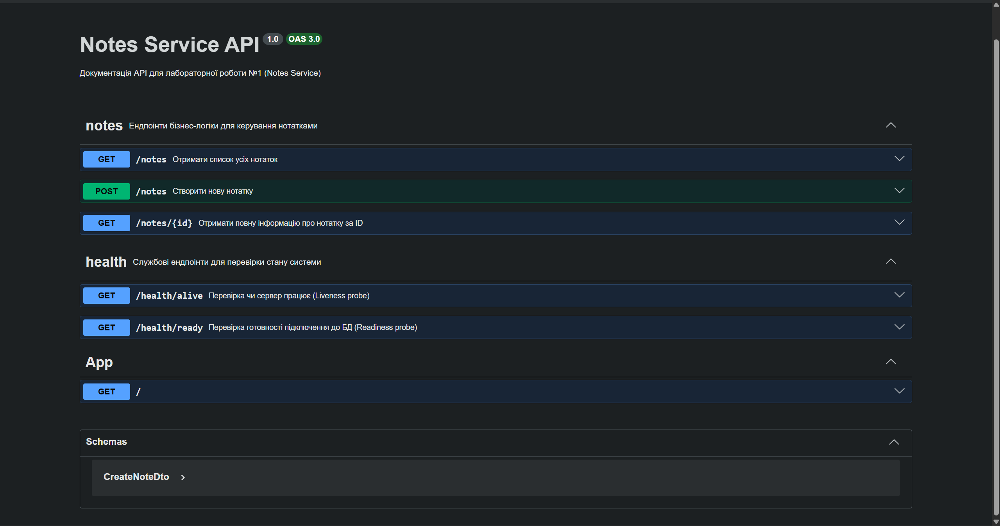

# Лабораторна робота №1, Малуєв Павло ІМ41: Розгортання Web-сервісу з автоматизацією

## 1\. Варіант індивідуального завдання

Розрахунок проведено на основі номера залікової книжки студента: **N = 14840136**.

  * **V2** = (14840136 % 2) + 1 = **1** (**MariaDB**, Конфігурація через **аргументи командного рядка**)
  * **V3** = (14840136 % 3) + 1 = **1** (**Notes Service** — сервіс для зберігання текстових нотаток)
  * **V5** = (14840136 % 5) + 1 = **2** (Порт застосунку: **5200**)

-----

## 2\. Про застосунок (Notes Service)

Веб-застосунок реалізований на фреймворку **NestJS 11** із використанням **Prisma ORM** для взаємодії з БД.

### Можливості:

  * Збереження нотаток (ID, заголовок, зміст, дата створення).
  * Автоматична міграція бази даних через `prisma db push` перед стартом.
  * **Content Negotiation**: сервіс повертає JSON для API-клієнтів та HTML-таблиці для браузерів (за заголовком `Accept`).
  * Перевірка стану (`Health Checks`).
  * **Socket Activation**: застосунок не відкриває порт самостійно, а отримує його від `systemd`.

-----

## 3. Документація API (Swagger)
Проєкт використовує **Swagger UI** для автоматичної документації та тестування ендпоінтів. 

* **Повне API:** [http://localhost:5200/api/docs](http://localhost:5200/api/docs)
* **Нотатки (Business Logic):** [http://localhost:5200/api/docs#/notes](http://localhost:5200/api/docs#/notes)
* **Стан системи (Health):** [http://localhost:5200/api/docs#/health](http://localhost:5200/api/docs#/health)

> **Інтерфейс Swagger:**
> 

-----

## 4\. Розгортання та автоматизація

### Вимоги до Віртуальної Машини:

  * **Дистрибутив:** Ubuntu 24.04 LTS.
  * **Ресурси:** 2 vCPU, 2GB RAM, 15GB Disk.
  * **Мережа:** Відкритий порт 80 (HTTP).

### Як запустити автоматизацію:

1.  Склонуйте репозиторій:
    ```bash
    git clone git@github.com:inryceu/2-course-Software-Deployment-Technologies-labs.git
    cd Lab1/automation
    ```
2.  Запустіть скрипт розгортання:
    ```bash
    sudo chmod +x deploy.sh
    sudo ./deploy.sh
    ```

### Що робить скрипт:

  * Встановлює `Node.js 22`, `MariaDB`, `Nginx`.
  * Створює користувачів `student`, `teacher`, `operator`, `app`.
  * Налаштовує **Limited Sudo** для `operator` (тільки керування сервісом та reload nginx).
  * Конфігурує **systemd socket activation** (`mywebapp.socket`).
  * Налаштовує Nginx як Reverse Proxy з обмеженням доступу до `/health` (тільки локально).

-----

## 5\. Безпека та Адміністрування

### Користувачі в системі:

  * **student / teacher**: Повний доступ (sudo). Пароль за замовчуванням: `12345678` (вимагає зміни при першому вході).
  * **operator**: Може тільки:
      * `systemctl status/start/stop/restart mywebapp`
      * `nginx -s reload`
  * **app**: Системний користувач без права входу, від якого працює код.

### Обмеження Nginx:

Nginx налаштований так, що назовні (порт 80) проксуються лише дозволені шляхи. Всі спроби зайти на неіснуючі ендпоінти повертають **403 Forbidden**.

## 6\. Тестування системи

Після виконання скрипта перевірте працездатність командами:

1.  **Перевірка API (JSON):**
    ```bash
    curl -H "Accept: application/json" http://localhost/notes
    ```
2.  **Перевірка HTML (Browser style):**
    ```bash
    curl -H "Accept: text/html" http://localhost/notes
    ```
3.  **Перевірка прав оператора:**
    ```bash
    su - operator
    sudo systemctl status mywebapp  # Має спрацювати
    sudo apt update                 # Має бути заборонено
    ```

-----