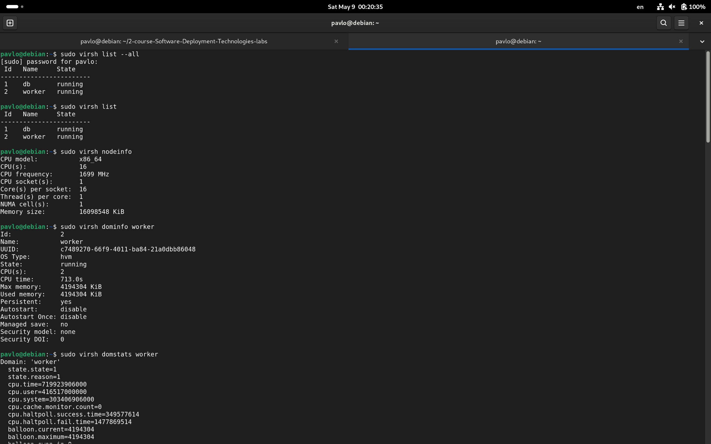
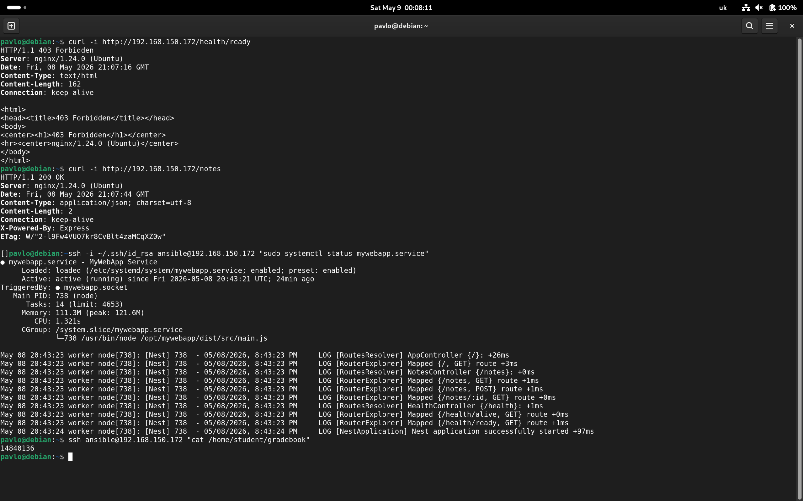

# Lab №4: Infrastructure as Code with Terraform & Ansible

## Висновки (Conclusions)

Успішне розгортання NestJS додатку на двох Ubuntu 24.04 ВМ з використанням Terraform і Ansible:
- ✅ Автоматизована інфраструктура (2 ВМ в libvirt мережі)
- ✅ Ansible playbooks конфігурують MariaDB, Node.js, Nginx
- ✅ Systemd service з health checks (`/health/alive`, `/health/ready`)
- ✅ UFW firewall rules для безпеки
- ✅ Перевірено: додаток запущений, API доступна, gradebook = 14840136

**Скріншоти результатів:**



---

## Передумови

1. Terraform з libvirt provider
2. Ansible 2.9+ (Python 3.9+)
3. SSH ключ: `~/.ssh/id_rsa.pub`
4. libvirt daemon запущений
5. Ubuntu 24.04 cloud image

## Як Запустити

```bash
# 1. Підготовка змінних
cd terraform
cat > terraform.tfvars << EOF
ssh_public_key = file("~/.ssh/id_rsa.pub")
worker_vcpu    = 4
worker_memory  = 8192
db_vcpu        = 2
db_memory      = 4096
EOF

# 2. Розгортання
terraform init
terraform plan
terraform apply

# 3. Генерування inventory
cd ../scripts
bash generate_inventory.sh

# 4. Конфігурація
cd ../ansible
ansible-playbook -i hosts.ini playbook.yml

# 5. Перевірка
ssh -i ~/.ssh/id_rsa ansible@<worker_ip>
curl http://<worker_ip>/health/ready
curl http://<worker_ip>/notes
cat /home/student/gradebook  # Має бути: 14840136
```

## 🏗️ Основні Компоненти

- **terraform/** — 2 ВМ (worker + db) в приватній мережі libvirt
- **ansible/** — 3 roles (common, db, worker) для повної конфігурації
- **app/** — NestJS додаток з Prisma ORM
- **scripts/** — generate_inventory.sh для автоматичного створення hosts.ini

## Architecture

```
┌─────────────────────────────────────────────┐
│     Private Network (192.168.150.0/24)      │
├─────────────────────────────────────────────┤
│ worker VM          │         db VM          │
│ • Nginx:80         │    • MariaDB:3306      │
│ • NestJS:5200      ├───► • notes_db         │
│ • Ubuntu 24.04     │    • Ubuntu 24.04      │
└─────────────────────────────────────────────┘
```

## Користувачі

- **ansible** — SSH user (passwordless sudo)
- **teacher** — password: `12345678` (sudo access)
- **operator** — password: `12345678` (systemctl/nginx commands)
- **app** — systemd service user (NestJS)
- **MariaDB app user** — `app:app_secure_pass` (db access)

## Ключові Особливості

✅ Ідемпотентність — запускайте playbook багато разів без побічних ефектів  
✅ Мережева безпека — БД доступна тільки з worker VM  
✅ Health checks — API endpoints для моніторингу стану  
✅ Systemd service — автоматичний перезапуск при падіннях  

## Швидка Перевірка

```bash
# Статус ВМ
terraform output
virsh list --all

# Логи
ssh ansible@<worker_ip>
sudo journalctl -u mywebapp -f

# Health
curl http://<worker_ip>/health/ready
curl http://<worker_ip>/health/alive
```

## Troubleshooting

- **SSH issues** — перевірте `terraform output` для IP адреси
- **DB connection** — `mysql -h <db_ip> -u app -p'app_secure_pass' notes_db`
- **App logs** — `journalctl -u mywebapp -n 50`
- **UFW rules** — `sudo ufw status`

---

**Джерела:**  
- Terraform: https://registry.terraform.io/providers/dmacvicar/libvirt  
- Ansible: https://docs.ansible.com/  
- Lab1: `../Lab1/README.md`
